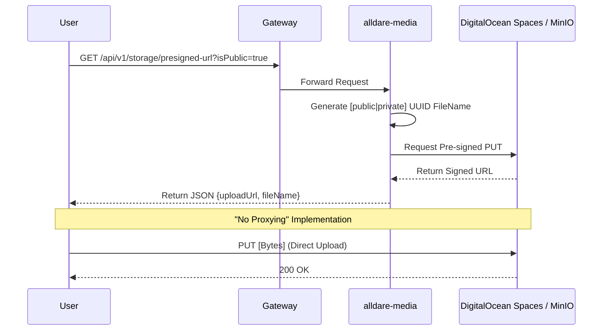

# alldare-media

Media storage gatekeeper. Manages S3 interactions and enforces the "No-Proxy" strategy.

## Handshake Flow

## Security: Prefix-Based Isolation
To prevent unauthorized access through the CDN, files are physically segregated:
*   **Public Path:** `public/{authorId}/{uuid}{ext}` -> Accessible via CDN.
*   **Private Path:** `private/{authorId}/{uuid}{ext}` -> BLOCKED by CDN. Only accessible via Pre-signed GET URLs.
